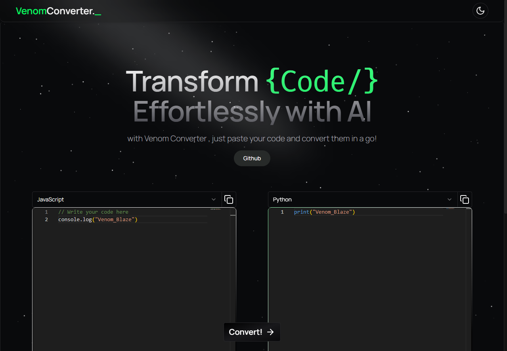

# ⚡️ Venom Converter – Effortless Code Conversion with AI

Convert code between languages or formats in seconds using AI-powered magic. Built with love, speed, and elegance.  



---

## 🚀 Features

- ✨ Instant code conversion using AI
- 🧠 Intuitive and developer-friendly UI
- ⚙️ Built with Next.js + Tailwind + Bun
- 🧩 Modular, clean component structure
- 💡 Fully open-source and customizable

---

## 📦 Prerequisites

Ensure you have **Node.js** or **Bun** installed.

Check your version:

```bash
node -v
# or
bun -v
If not installed, grab it from nodejs.org or bun.sh.

🛠️ Installation
1. Clone the Repository
bash
Copy
Edit
git clone https://github.com/venomblaze-alpha/code-converter.git
cd code-converter
2. Install Dependencies
Using npm:

bash
Copy
Edit
npm install
Or with Bun:

bash
Copy
Edit
bun install
3. Start the Dev Server
Using npm:

bash
Copy
Edit
npm run dev
Or with Bun:

bash
Copy
Edit
bun run dev
Open your browser and visit: http://localhost:3000

📥 Download as ZIP
Prefer not to use Git? You can download the project as a ZIP file and extract it manually.

🤝 Contributing
We welcome community contributions!
Feel free to open issues, suggest features, or create pull requests.

Want to contribute?

Fork the repo

Create your feature branch (git checkout -b feature/amazing-feature)

Commit your changes (git commit -m 'Add amazing feature')

Push to the branch (git push origin feature/amazing-feature)

Open a pull request 🚀

👤 Owner
Built and maintained by Venom
Feel free to reach out with any questions, ideas, or feedback!
